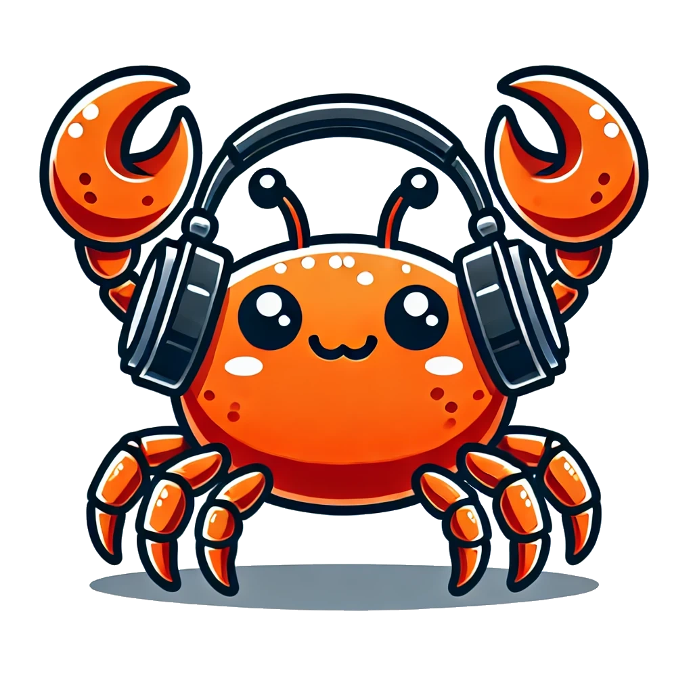

<br>

# Project for PvR: Discord MusicBot in Rust
- Author: Pavel Mikula (MIK0486)
- Took approximately 40 hours

## Project Theme
This project is a simple Discord bot developed in Rust, designed to play music in Discord voice channels. It uses libraries like `serenity` for handling the Discord API and `songbird` for managing audio playback and `youtube-api` for track download. The bot allows users to add, play, pause, and skip songs in a queue directly within a Discord server.

## Project Requirements
- Rust: The primary programming language for bot logic
- Serenity: Discord API wrapper for Rust
- Songbird: Voice and audio playback library for Discord
- Youtube-dl: For downloading and streaming audio from YouTube

## Instalation
### Prerequisites
- Installed rust from [rust-lang.org](https://www.rust-lang.org/tools/install)
- Installed youtube-dl from [ytdl-org.github.io](https://ytdl-org.github.io/youtube-dl/)
  - `ffmpeg` is required for youtube-dl to work properly
  - `youtube-dl` should be in the system PATH
- YouTube DL token from [YouTube Data API](https://developers.google.com/youtube/registering_an_application)
- Discord bot token from [Discord Developer Portal](https://discord.com/developers/applications)
- Installed CMAKE. Required for an [audiopus_sys](https://github.com/Lakelezz/audiopus_sys) library

### Installation
1. Clone this repository
    ```bash
    git clone https://github.com/Firestone82/RustyTunes.git
    cd RustyTunes
    ```
2. Create a `.env` file in the root directory
    ```bash
    cp .env.example .env
    
    # Edit the .env file with your discord bot token and youtube dl API key.
    ```
3. Setup database
    ```bash
    cargo install sqlx-cli
    sqlx database create
    sqlx migrate run
     ```
4. Install dependencies
    ```bash
   # Youtube DL
   sudo curl -L https://github.com/yt-dlp/yt-dlp/releases/latest/download/yt-dlp -o /usr/local/bin/yt-dlp
   sudo chmod a+rx /usr/local/bin/yt-dlp
   
   # CMAKE
   sudo apt-get install cmake
    ```
5. Build and run the bot
    ```bash
    cargo build --release
    cargo run
    ```

## Features
- Play music from YouTube and other audio sources in voice channels
- Queue management: add, remove, or reorder songs
- Basic music controls: play, pause, resume, and skip tracks
- Volume control
- Custom addons
  - Wakeup command (Moves client between rooms to make sound!)
  - Notify command (Notify user to specific message after some time.)
  - Uwu command (Uwuify text provided)
